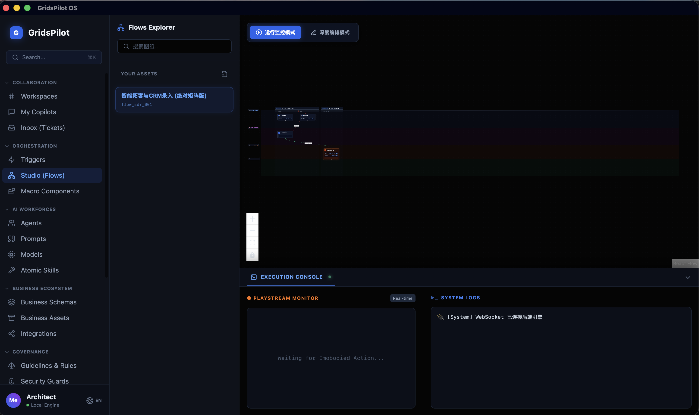
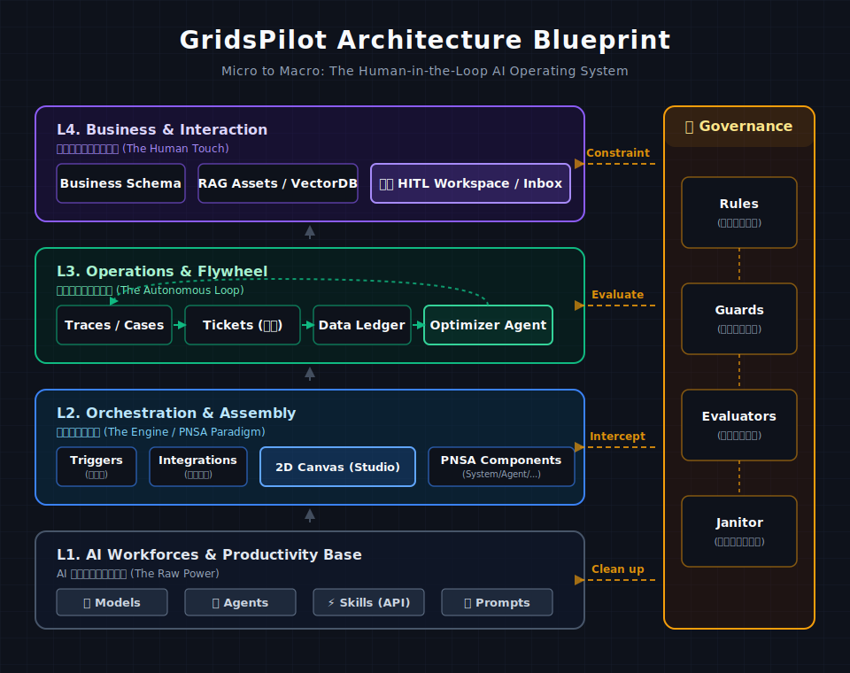

<div align="center">
  <h1>GridsPilot: An AI-Native Business OS</h1>
  <p><b>Bridging the gap between Autonomous Agents and Enterprise Workflows.</b></p>

  <!-- 明显的下载引导区 -->
  <div style="background-color: #0E121B; padding: 24px; border-radius: 12px; margin: 20px 0; border: 1px solid #1E293B; box-shadow: 0 10px 30px rgba(0,0,0,0.5);">
    <p style="color: #94A3B8; margin-bottom: 12px; font-size: 14px; letter-spacing: 1px; text-transform: uppercase;"><b>⬇️ Get Started with Desktop Client</b></p>
    <a href="https://github.com/hu8627/GridsPilot/releases/latest" target="_blank">
      
    </a>
    &nbsp;&nbsp;
    <a href="#" style="cursor: not-allowed; filter: grayscale(100%); opacity: 0.7;">
      
    </a>
  </div>

  <br>
  
  > **"This might be closer to the true form of future human-AI collaboration: <br> AI executes, humans supervise and provide the safety net."**
  > 
  > **"这可能更接近未来人类与 AI 协同工作的真实形态——AI 负责执行，人类负责监督和兜底。"**

  <br>
  

  <br><br>

  <p>
    <a href="#english-version"><b>🇬🇧 English Documentation</b></a> • 
    <a href="#中文说明文档"><b>🇨🇳 中文说明文档</b></a>
  </p>
</div>

---

<h2 id="english-version">🇬🇧 English Version</h2>

### 🤔 Why I built this?

When attempting to deploy AI Agents (e.g., LLM-based web scrapers, automated data entry scripts) into real-world business scenarios, I encountered a massive pain point: **The execution process is too much of a "black box" and the fault tolerance is extremely low.**

Current solutions face a dilemma:
*   **Code-only Agents (e.g., AutoGPT/Devin)**: Once they run, you can only stare at dense terminal logs. If it gets stuck on a web form or encounters a distorted CAPTCHA, the entire task crashes, leaving you no chance to intervene.
*   **Traditional Workflows (e.g., Coze/Dify)**: While they offer node graphs, they lack fine-grained monitoring and human-takeover mechanisms for long-running asynchronous tasks that require "embodied actions."

Thus, I conceived and built **GridsPilot**.

The core idea is simple: **Draw the Agent's execution logic as a visible blueprint (DAG) or execute according to a confirmed logic, and place a "brake (Auditor)" at critical nodes. If the AI hits its capability boundary, freeze the frame, push it to a human, let the human click a button in the console, and the AI resumes running with the human's input.**

As the project slogan states, GridsPilot does not pursue blind "full automation" but strives to build an extremely elegant **Human-in-the-Loop (HITL) Workbench**.

### 📊 The Paradigm Shift (Why GridsPilot Wins)

<div align="center">
  
</div>

GridsPilot positions itself in the ultimate "Sweet Spot" for enterprise AI: **Deterministic Skeletons + Local Autonomy**. It avoids the brittle nature of fully dynamic topologies while retaining the flexibility of LLM reasoning within strictly governed boundaries.

### 🏛️ The Architecture Blueprint: Micro to Macro

<div align="center">
  
</div>

GridsPilot is an Operating System designed for "Governance First, Intelligence Second." The entire architecture is rigorously divided into three dimensions:

#### 1. Micro-Level: The 4 Executors & PNSA Paradigm
At the atomic level, AI's generalized intelligence must be contained. We invented the **PNSA Architecture**, strictly isolating the computational and physical boundaries of every node into 4 Execution Roles:
*   ⚙️ **SYSTEM (Code)**: Deterministic infrastructure (e.g., DB writes). Zero hallucination.
*   🧠 **AGENT (LLMs)**: Generalized intelligence (e.g., reasoning). Mounted with specific Models.
*   🧑‍💻 **HUMAN (Admin)**: The ultimate safety net. Pushing dynamic forms to an Inbox for manual approval.
*   🦾 **HARDWARE (IoT)**: Physical world interaction (e.g., moving a robotic arm).

#### 2. Meso-Level: 2D Orthogonal Matrix Canvas
We abandoned the chaotic "spider-web" node graphs. GridsPilot Studio introduces a revolutionary **2D Matrix Canvas** to orchestrate the micro-executors:
*   **X-Axis (Time & Logic)**: Divided by `Phases` and `Sublanes` (e.g., Main Pipeline vs. Exception Branch).
*   **Y-Axis (Actor Rows)**: Fixed horizontal tracks representing the 4 Execution Roles.
*   *Result: A complex cross-departmental flow looks like a pristine industrial assembly line. You instantly know WHICH role is doing WHAT at WHICH time.*

#### 3. Macro-Level: The 6 Domains & Data Flywheel
GridsPilot manages the enterprise AI ecosystem through 6 highly decoupled domains, all backed by a strict `SQLite` relational schema:
1.  **Collaboration**: Group Chats (`Workspaces`) and Private Assistants (`Copilots`).
2.  **Orchestration**: `Triggers` (Cron/Webhooks) awaken the `Studio` flows.
3.  **AI Workforces**: Manage `Agents`, `Models`, `Skills`, and `Prompts`.
4.  **Business Ecosystem**: Define `Business Schemas` and mount external `Assets` (VectorDBs).
5.  **Governance**: The highest law. Define `Rules` and set up `Guards` (probes) for interception.
6.  **Records & Insights (The Flywheel)**: Raw **`Traces`** -> Structured **`Cases`** -> Intercepted **`Tickets`** (Human Workbench) -> Feedback to **`Ledger`** to fuel the Optimizer Agent for self-evolution.

---

<br>

<h2 id="中文说明文档">🇨🇳 中文说明文档</h2>

### 🤔 为什么做这个项目？

在尝试将 AI Agent落地到真实的业务场景时，我遇到了一个巨大的痛点：**执行过程太“黑盒”了，且容错率极低。**

现有的方案往往面临两难：
*   **纯代码 Agent (如 AutoGPT/Devin)**：一旦运行，你只能在终端里看着密密麻麻的 Log。如果遇到极度扭曲的验证码，整个任务直接崩溃，人类连介入帮忙的机会都没有。
*   **传统 Workflow (如 Coze/Dify)**：虽然有连线图，但对这种需要“具身操作”的长异步任务，缺乏企业级的细粒度监控和人工接管机制。

因此，我构思并写下了 **GridsPilot**。

它的核心思路很简单：**把 Agent 的执行逻辑画成可见的二维图纸，或者按已确认的基建逻辑执行，并在关键节点挂上“刹车 (Auditor)”。如果 AI 遇到了能力边界，把画面定格推给人类，人类在控制台点一下，AI 带着人类的输入继续跑。**

正如项目标语所言，GridsPilot 不追求盲目的“全自动”，而是致力于打造一个极其优雅的**人机协同工作台 (Human-in-the-Loop Workbench)**。

### 📊 范式转移：为什么企业需要 GridsPilot？

<div align="center">
  
</div>

GridsPilot 将自己定位在企业级 AI 落地的“甜点区”：**确定性骨架 + 局部自治**。它避开了全自动拓扑生成极易崩溃的“盲区”，同时利用大模型保留了节点内部的推理灵活性，并辅以绝对安全的人机熔断机制。

### 🏛️ 核心架构：从微观到宏观的降维打击

<div align="center">
  
</div>

GridsPilot 绝不是一个简单的画图工具，它将企业级 AI 架构完美抽象为三个维度的严密咬合：

#### 1. 微观 (执行器)：四权分立与 PNSA 范式
在原子层面，我们认为 **AI 的泛化智力必须被关进系统控制的笼子里**。我们首创了 PNSA (参数/节点/监督/审计) 架构，将节点内的执行者严格区分为四个互不僭越的物理边界：
*   ⚙️ **SYSTEM (系统基建)**：确定性的死代码（如查库、调API）。零幻觉，成本极低。
*   🧠 **AGENT (模型推理)**：泛化智力。可动态挂载不同的大模型和人设 Prompt。
*   🧑‍💻 **HUMAN (人工干预)**：系统的终极护城河。节点可配置“强制挂起”，将动态表单推送至 Inbox，交还决策权。
*   🦾 **HARDWARE (物理硬件)**：具身智能的触角。驱动外接的机械臂或 IoT 设备。

#### 2. 中观 (编排面)：二维正交矩阵画板
我们彻底抛弃了杂乱无章的“蜘蛛网”式连线图。GridsPilot 独创了工业级的 **正交矩阵布局 (Matrix Layout)**：
*   **X 轴 (阶段与泳道)**：定义时间流转与业务分支（主干道 vs 异常重试跑道）。
*   **Y 轴 (执行角色轨道)**：横跨全图的四色底带，对应 `SYSTEM` -> `AGENT` -> `HUMAN` -> `HARDWARE`。
*   *效果：极其复杂的跨部门业务蓝图在这个矩阵中铺开，控制权在机器与人类之间的交接一目了然，宛如拼装工业乐高。*

#### 3. 宏观 (全景域)：六大业务域与数据飞轮
整个操作系统基于 11 张结构化的 SQLite 物理表，将庞大的应用抽象为 6 大业务域，形成严密的数据飞轮：
1. **协同工作区 (Collaboration)**：人机交互的前台。包含多智能体群聊 (`Workspace`) 与专属私助 (`Copilot`)。
2. **编排与组装区 (Orchestration)**：架构师的车间。绑定发令枪 (`Triggers`)，在 `Studio` 矩阵中拖拽并封装宏组件 (`Components`)。
3. **AI 算力总成 (Workforces)**：配置 `Models`，沉淀 `Prompts`，注册底层技能，捏造出 `Agents`。
4. **业务生态底座 (Ecosystem)**：定义行业元数据 (`Schemas`)，挂载外部 RAG 私有知识库 (`Assets`) 与集成凭证 (`Integrations`)。
5. **治理域 (Governance)**：系统的最高宪法。起草业务合规法则 (`Rules`)，并据此在节点上布置实时拦截探针 (`Guards`) 和独立评估器 (`Evaluators`)。
6. **记录与洞察域 (Records & Insights) [核心飞轮]**：
    *   引擎跑出底层无情流水 **`Traces`**。
    *   提炼为结构化业务实例 **`Cases`**。
    *   探针拦截异常，生成 **`Tickets`** 丢给人类在 Workbench 处理。
    *   人类修正的错题本沉淀提取出 **`Insights`** 基因，唤醒 `Optimizer Agent` 自动重写业务图纸，实现**系统自进化**！

---

## 🛠️ The Tech Stack (技术栈)

GridsPilot 采用了现代化的架构，支持 Web 端轻量部署与 Tauri 桌面端原生运行（Sidecar 伴生模式）。

*   **Desktop Shell**: `Tauri 2.0` + `Rust`
*   **Frontend (The Cockpit)**: `Next.js 14` + `TailwindCSS` + `React Flow` (@xyflow/react) + `Zustand`
*   **Backend (The Orchestrator)**: `FastAPI` + `LangGraph` + `LiteLLM`
*   **Storage**: `SQLite` via `SQLAlchemy` (Fully typed relational schemas for Flows, Agents, Cases, Prompts, etc.)

---

## 🚀 Quick Start (快速开始)

GridsPilot 支持两种启动模式。作为开发者，推荐使用 Web 双开热更新模式；如果想体验原生 OS 或打包客户端，请使用 Tauri 模式。

### Option 1: Web Mode (For Development / 开发模式)
```bash
# 后端 (The Engine):
cd backend
python -m venv venv
source venv/bin/activate
pip install -r requirements.txt
uvicorn app.main:app --reload --port 8000

# 前端 (The Cockpit):
cd frontend
npm install
npm run dev # 浏览器打开 http://localhost:3000
```

### Option 2: Desktop OS Mode (Tauri 桌面原生模式)
*(Requires Rust installed on your machine)*
```bash
# 1. 编译并注入 Python 引擎伴生进程 (在根目录执行)
chmod +x build_engine.sh
./build_engine.sh

# 2. 拉起原生桌面端调试
cd frontend
npm run tauri dev

# 💡 3. 一键打包为您自己的独立客户端 (.dmg / .exe)
npm run tauri build
```

---

## 🗺️ Roadmap & To Do List

开源这套架构，是希望提供一个 **“拥有严密逻辑和极高视觉审美的 AI OS 脚手架”**。目前的 V0.1 版本已跑通核心的端到端闭环：

**✅ Completed (已完成的里程碑)**
- [x] 深度定制 React Flow 引擎，实现带有 `Phase/Sublane` 嵌套的工业级二维矩阵 (Matrix) 泳道布局。
- [x] 构建四权分立 (System/Agent/Human/Hardware) 的 BPNL JSON 编译器。
- [x] 极具统治力的 6 大业务域、16 个微服务核心模块前台 UI 路由全景映射。
- [x] 升级为基于 `SQLite / SQLAlchemy` 的结构化资产持久层，包含 11 张核心物理表。
- [x] 通过 `Tauri + Python Sidecar` 模式，成功封装并打包为 Local-First 的独立桌面客户端。

**🚧 To Do List (亟待社区共建的核心深水区)**
- [ ] **[Backend]** 接入 `Celery` / `Temporal`。将目前的单线程阻断式调度升级为支持极高并发的分布式任务队列。
- [ ] **[Backend]** 接入 `PostgreSQL` 作为 LangGraph 的 Checkpointer，实现真正意义上跨服务器、抗宕机的任务挂起与唤醒（HITL 断点续传）。
- [ ] **[Execution]** 将 `browser-use` (Playwright) 封装为标准原子动作，拦截浏览器执行时的每一帧画面，并转为 Base64 通过 WebSocket 推流至前端的 Monitor 监控屏。
- [ ] **[Evolution]** 完善 `Optimizer Agent`。基于 Ledger 中收集的人工接管记录（Cases），辅以 RAG 检索，利用大模型自动重写底层 BPNL，实现图纸和业务逻辑的自动进化。

---

## 📄 License & Contact

GridsPilot is released under the **AGPL-3.0 License**. 

This means you are free to use, study, and modify GridsPilot for personal or internal non-commercial testing environments. However, if you intend to use GridsPilot in a **commercial product, SaaS service, or as the core scheduling engine of an internal closed-source enterprise system**, and you do not wish to open-source your entire modified backend code, **you MUST purchase a Commercial License**.

*If you find the architectural design or the UI/UX concepts of GridsPilot valuable for your enterprise use cases, or if you're interested in consulting / custom development / commercial licensing, feel free to reach out:*

**Contact:** charismamikoo@gmail.com

---
<div align="center">
  <p><i>Built for the hackers who want control over their Agents.</i></p>
  <p><b>Special thanks: Core architecture and philosophy co-created via inference with Gemini.</b></p>
</div>