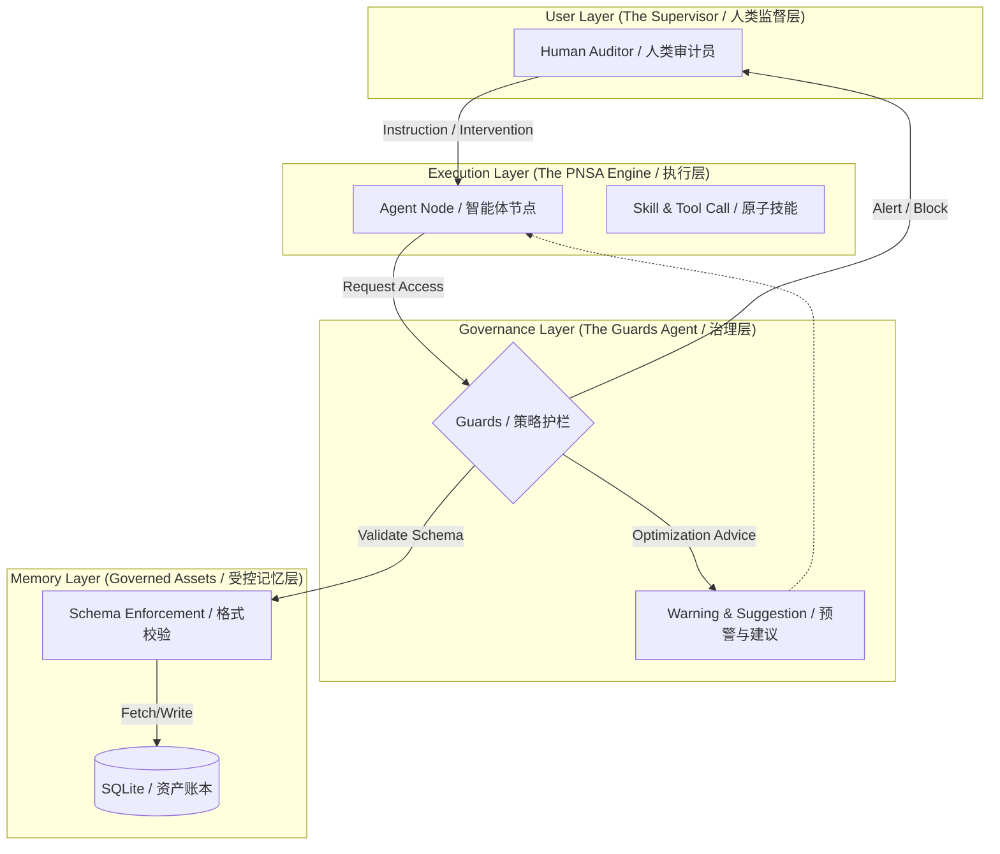

# 🌊 NexaFlow: An AI-Native Business OS

<div align="center">
  <p><b>Bridging the gap between Autonomous Agents and Enterprise Governance.</b></p>
  <p><b>连接自主智能体与企业级治理边界的桥梁。</b></p>
  <p><i>A highly visual, Human-in-the-Loop (HITL) orchestration framework for the Agentic Era.</i></p>

  <br>

  > **"AI executes, Humans supervise, Assets persist, and Guards govern."**
  > <br>
  > **"AI 负责执行，人类负责监督，资产负责沉淀，Guards 负责治理。"**
  
  

  <p>
    <a href="#-the-philosophy"><b>🧠 Philosophy</b></a> • 
    <a href="#-pnsa-architecture"><b>🏗️ Architecture</b></a> • 
    <a href="#-core-features"><b>✨ Features</b></a> • 
    <a href="#-quick-start"><b>🚀 Quick Start</b></a>
  </p>
</div>

---

## 🧠 The Philosophy | 核心哲学: Management, Collaboration & Evolution

NexaFlow is built on the belief that **Intelligence is a commodity, but Governance is a Moat.** We translate classical human organizational wisdom into the AI stack:

NexaFlow 的核心理念是：**智力是商品，治理才是护城河。** 我们将经典的管理学智慧融入 AI 架构：

1.  **Separation of Powers (三权分立):**
    *   **The Execution (Agents/执行权):** The "Muscle." High-performance reasoning nodes focused on task completion. (负责干活，追求效能)
    *   **The Governance (Guards/治理权):** The "Judge." An Agentic monitor that audits every I/O, issues warnings, and provides human-intervenable suggestions. (负责审计，提供预警与建议)
    *   **The Truth (Assets/定义权):** The "Legislature." Schema-enforced shared memory that ensures data integrity. (负责事实，确保记忆的一致性与结构化)

2.  **DMAIC Iteration (持续演进):**
    NexaFlow follows the **Define-Measure-Analyze-Improve-Control** loop. By logging every intervention in our **Governed Ledger**, the system provides a "feedback thread" for the **Optimizer Agent** to auto-refine business logic.
    系统遵循 **DMAIC** 闭环。通过在**治理账本**中记录每一次人工干预，为“优化器 Agent”提供反馈，实现业务逻辑的自动化重写与进化。

---

## 🏗️ PNSA Architecture | 架构范式

NexaFlow’s core is the **PNSA Paradigm**, ensuring that AI's generalized intelligence is contained within system-controlled "cages."

### 🔄 The Governance Flow | 治理数据流
Below is how NexaFlow manages the interaction between execution and memory:



### The P-N-S-A Breakdown:
*   **[ P ] Parametric (参数化)**: Nodes dynamically mount Agents, Models, and Skills. (节点可动态挂载数字员工与模型)
*   **[ N ] Nodal (节点化)**: Physical isolation of context boundaries to prevent hallucinations. (物理隔离上下文，防止逻辑发散)
*   **[ S ] Supervisor (监督者)**: Edge-level logic that routes flows based on real-time outcomes. (基于执行结果动态路由的卫兵)
*   **[ A ] Auditor (审计员)**: **The Ultimate Moat.** Forces suspension at high-risk nodes, returning power to humans. (系统的终极熔断机制，将决策权还给人类)

---

## ✨ Core Features | 核心特性

1.  **💻 Local-First OS (本地优先)**: Packaged via **Tauri & Rust**. Absolute data privacy. All Flows and Keys are stored in your local `~/.nexaflow` SQLite. (下载即用，零配置，所有资产 100% 本地存储)
2.  **👀 100% Execution Visibility (全流程可视)**: A split-screen `Studio` providing a real-time glowing node graph and a live execution monitor. (双分屏工作室：左侧发光流转图，右侧实况监控屏，告别黑盒执行)
3.  **🛑 Human-in-the-Loop Workbench (人在回路工作台)**: Enable `interrupt_before: true` to freeze AI at critical nodes and push tasks to your **Inbox** for manual intervention. (在关键节点一键开启“刹车”，AI 遇阻时定格画面，等待人类审批或协助)
4.  **💬 Chat-to-SOP (自然语言生成流程)**: Describe a task; the **Copilot** generates a BPNL (Business Process Node Language) protocol and renders it instantly. (用嘴画图：自然语言描述任务，瞬间生成可二次修改的 BPNL 工业级流程图)

---

## 🛠️ Tech Stack | 技术栈

| Component / 组件 | Technology / 技术 |
| :--- | :--- |
| **Desktop Shell** | `Tauri 2.0` + `Rust` (Native Sidecar) |
| **Cockpit (FE)** | `Next.js 14` + `React Flow` + `Zustand` |
| **Orchestrator (BE)** | `FastAPI` + `LangGraph` + `LiteLLM` |
| **Memory/Storage** | `SQLite` via `SQLAlchemy` (Typed Schema) |

---

## 🚀 Quick Start | 快速开始

### Option 1: Web Mode (For Development / 开发模式)
```bash
# 后端 Backend:
cd backend
python -m venv venv && source venv/bin/activate
pip install -r requirements.txt
uvicorn app.main:app --reload --port 8000

# 前端 Frontend:
cd frontend
npm install && npm run dev
```

### Option 2: Desktop OS Mode (Tauri / 桌面原生模式)
```bash
# 编译 Python 引擎 Build the engine
chmod +x build_engine.sh && ./build_engine.sh

# 启动应用 Launch
cd frontend
npm run tauri dev
```

---

## 🗺️ Roadmap | 路线图

- [ ] **Observability 2.0**: R2D3-inspired visual engine for real-time "Memory Cleansing" traces. (受 R2D3 启发的高级记忆清洗可视化引擎)
- [ ] **Distributed Task Queue**: Integrating `Temporal` for high-concurrency enterprise resilience. (接入分布式任务队列，支持高并发企业级调度)
- [ ] **Self-Evolving Logic**: Refine `Optimizer Agent` to auto-rewrite BPNL based on historical Intervention Cases. (完善优化器 Agent，基于人工干预历史自动重写业务逻辑)
- [ ] **Browser-Use Monitor**: Stream real-time Playwright execution frames to the monitor screen. (实时浏览器执行画面流式推送到监控屏)

---

## 📄 License & Commercial | 许可与商业授权

NexaFlow is released under the **AGPL-3.0 License**. 

*   **Open Source**: Free for personal study and non-commercial testing. (个人学习与非商用测试完全免费)
*   **Commercial Use**: NexaFlow uses the **AGPL-3.0** license by default. If you need to integrate NexaFlow into a **closed-source commercial product or internal enterprise system** and cannot comply with the open-source obligations of AGPL, please contact us for a **Commercial License**.
*   **商业授权**: 本项目默认采用 **AGPL-3.0** 协议。如果您需要在**闭源商业产品**或**企业内部闭源系统**中集成 NexaFlow，且无法遵守 AGPL 的开源义务（如公开衍生代码），请联系我们获取 **商业授权 (Commercial License)**。

📧 **Contact / 咨询:** [charismamikoo@gmail.com]

---

<div align="center">
  <p><b>Built for the hackers who want absolute control over their Agents.</b></p>
  <p><b>为那些追求对 Agent 拥有绝对控制权的黑客而生。</b></p>
  <br>
  <p>✨ <i>Special thanks: Core architecture and philosophy co-created via inference with Gemini.</i></p>
  <p><i>特别鸣谢：本项目核心架构与理念由 Gemini 协同推演创作。</i></p>
</div>
