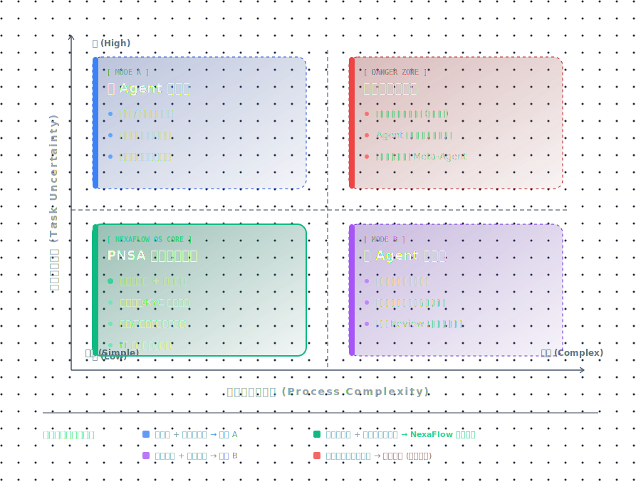

<div align="center">
  <h1>GridsPilot: An AI-Native Business OS</h1>
  <p><b>Bridging the gap between Autonomous Agents and Enterprise Workflows.</b></p>

  <!-- 增加一个明显的下载引导区 -->
  <div style="background-color: #f6f8fa; padding: 20px; border-radius: 10px; margin: 20px 0;">
    <p style="color: #555; margin-bottom: 10px;"><b>Get Started with Desktop Client</b></p>
    <a href="https://github.com/hu8627/GridsPilot/releases/latest" target="_blank">
      
    </a>
    <a href="#" style="cursor: not-allowed; filter: grayscale(100%);">
      
    </a>
  </div>

  <br>
  

  <p>
    <a href="#english-version"><b>English Documentation</b></a> • 
    <a href="#中文说明文档"><b>中文说明文档</b></a>
  </p>
</div>

---

<h2 id="english-version">English Version</h2>

### Why I built this?

When attempting to deploy AI Agents (e.g., LLM-based web scrapers, automated data entry scripts) into real-world business scenarios, I encountered a massive pain point: **The execution process is too much of a "black box" and the fault tolerance is extremely low.**

Current solutions face a dilemma:
*   **Code-only Agents (e.g., AutoGPT/Devin)**: Once they run, you can only stare at dense terminal logs. If it gets stuck on a web form or encounters a distorted CAPTCHA, the entire task crashes, leaving you no chance to intervene.
*   **Traditional Workflows (e.g., Coze/Dify)**: While they offer node graphs, they lack fine-grained monitoring and human-takeover mechanisms for long-running asynchronous tasks that require "embodied actions."

Thus, I conceived and built **GridsPilot**.

The core idea is simple: **Draw the Agent's execution logic as a visible blueprint (DAG) or execute according to a confirmed logic, and place a "brake (Auditor)" at critical nodes. If the AI hits its capability boundary, freeze the frame, push it to a human, let the human click a button in the console, and the AI resumes running with the human's input.**

As the project slogan states, GridsPilot does not pursue blind "full automation" but strives to build an extremely elegant **Human-in-the-Loop (HITL) Workbench**.

### The Paradigm Shift (Why GridsPilot Wins)

<div align="center">
  
</div>

GridsPilot positions itself in the ultimate "Sweet Spot" for enterprise AI: **Deterministic Skeletons + Local Autonomy**. It avoids the brittle nature of fully dynamic topologies while retaining the flexibility of LLM reasoning within strictly governed boundaries.

### Core Features

1. **Local-First Desktop App**: GridsPilot is not just a web app; it's packaged as a lightweight native desktop client using **Tauri & Rust**. Zero-setup, absolute data privacy. All your flows, API keys, and ledgers are stored securely on your local machine (`~/.GridsPilot`).
2. **100% Execution Visibility**: Say goodbye to staring at terminal strings. GridsPilot's frontend provides a split-screen `Studio`: the left side shows the glowing, flowing node graph, and the right side is a live stream monitor.
3. **Elegant Human-in-the-Loop Workbench**: When orchestrating nodes, you can enable `interrupt_before: true`. When the AI reaches here (e.g., before writing sensitive data to CRM), the workflow suspends. The task appears in your `Inbox (Workbench)`, waiting for your personal click to "resume."
4. **Chat-to-SOP (Dynamic Intent Routing)**: Describe a complex task in natural language in the `Copilot` window. The underlying LLM precisely matches and retrieves the verified BPNL (JSON) protocol, rendering an interactive business flowchart instantly.

### Core Architecture: The PNSA Paradigm

GridsPilot's underlying philosophy is: **AI's generalized intelligence must be contained within system-controlled cages.** Therefore, GridsPilot invented the **PNSA Architecture**, restructuring workflows and LLM Agents:

*   **[ P ] Parametric**: Nodes dynamically mount specific Agents, underlying Models, and atomic Skills.
*   **[ N ] Nodal**: Physical isolation of context boundaries. Splitting long-chain tasks into discrete nodes prevents LLMs from falling into infinite loops.
*   **[ S ] Supervisor**: The dynamic guard on the edges. Based on the previous Agent's execution result, it dynamically decides the next route.
*   **[ A ] Auditor (The Ultimate Moat)**: Facing high-risk nodes (e.g., writing to CRM), the engine is forcefully suspended, returning decision-making power to humans.

---

<br>

<h2 id="中文说明文档">中文说明文档</h2>

### 为什么做这个项目？

在尝试将 AI Agent（如基于大模型的网页操控、自动化录入脚本）落地到真实的业务场景时，我遇到了一个巨大的痛点：**执行过程太“黑盒”了，且容错率极低。**

现有的方案往往面临两难：
*   **纯代码 Agent (如 AutoGPT/Devin)**：一旦运行，你只能在终端里看着密密麻麻的 Log。如果它在一个表单页面卡住了，或者遇到了一个极度扭曲的验证码，整个任务直接崩溃，你连介入帮忙的机会都没有。
*   **传统 Workflow (如 Coze/Dify)**：虽然有连线图，但对这种需要“具身操作”的长时间异步任务，缺乏细粒度的监控和人工接管机制。

因此，我构思并写下了 **GridsPilot**。

它的核心思路很简单：**把 Agent 的执行逻辑画成可见的图纸 (DAG) 或者按照已确认的执行逻辑执行，并且在关键节点挂上一个“刹车 (Auditor)”。如果 AI 遇到了它的能力边界，把画面定格推给人类，人类在控制台点一下，AI 带着人类的输入继续跑。**

正如项目标语所言，GridsPilot 不追求盲目的“全自动”，而是致力于打造一个极其优雅的**人机协同工作台 (Human-in-the-Loop Workbench)**。

### 范式转移：为什么企业需要 GridsPilot？

<div align="center">
  
</div>

GridsPilot 将自己定位在企业级 AI 落地的“甜点区”：**确定性骨架 + 局部自治**。它避开了全自动拓扑生成极易崩溃的“盲区”，同时利用大模型保留了节点内部的推理灵活性，并辅以绝对安全的人机熔断机制。

### 核心特性 (Core Features)

1. **本地优先的桌面操作系统 (Local-First App)**：GridsPilot 不仅支持云端部署，更通过 **Tauri + Rust** 封装成了极度轻量的原生桌面客户端。下载即用，零配置门槛。所有的流程资产、大模型密钥 100% 存在本地 SQLite 数据库中，绝对守护企业隐私。支持一键打包为 `.dmg` 或 `.exe` 独立分发。
2. **100% 可视化的执行过程**：GridsPilot 提供了双分屏的 `Studio`：左侧是发光的矩阵式流转节点图，右侧是实况推流大屏，彻底告别执行黑盒。
3. **优雅的人机接管 (Workbench)**：在编排节点时，你可以开启 `interrupt_before: true`。当 AI 走到高危节点前，流程会安全挂起 (Suspended)。任务会出现在你的 `Inbox (Workbench)` 里，等待你亲自审批、补充参数并点击“确认放行”。
4. **Chat-to-SOP (意图路由检索)**：在 `Copilot` 窗口中用自然语言描述任务，底层的 LLM 会精准检索资产库中已认证的 BPNL 协议，并在前端瞬间渲染成可一键执行的业务流程图。

### 核心架构：PNSA 范式

GridsPilot 的底层哲学是：**AI 的泛化智力必须被关进系统控制的笼子里。** 为此，GridsPilot 独创了 **PNSA 架构**：

*   **[ P ] Parametric (参数化)**：节点内可动态挂载具体的数字员工 (Agent)、底层模型 (Model) 和原子能力 (Skills)。
*   **[ N ] Nodal (节点化)**：物理隔离上下文边界，彻底防止大模型在复杂任务中陷入“发散与死循环”。
*   **[ S ] Supervisor (监督者)**：连线上的动态卫兵。根据前置 Agent 的执行结果动态决定是走主干流水线，还是掉入异常处理分支。
*   **[ A ] Auditor (审计与熔断)**：**系统的终极护城河。** 面对高危物理或数据节点，引擎将被强制挂起，将决策权和物理按键交还给人类。

---

## The Tech Stack (技术栈)

GridsPilot 采用了现代化的架构，支持 Web 端轻量部署与 Tauri 桌面端原生运行（Sidecar 伴生模式）。

*   **Desktop Shell**: `Tauri 2.0` + `Rust`
*   **Frontend (The Cockpit)**: `Next.js 14` + `TailwindCSS` + `React Flow` (@xyflow/react) + `Zustand`
*   **Backend (The Orchestrator)**: `FastAPI` + `LangGraph` + `LiteLLM`
*   **Storage**: `SQLite` via `SQLAlchemy` (Fully typed relational schemas for Flows, Agents, Cases, Prompts, etc.)

---

## Quick Start (快速开始)

GridsPilot 支持两种启动模式。作为开发者，推荐使用 Web 双开热更新模式；如果想体验原生 OS 或打包客户端，请使用 Tauri 模式。

### Option 1: Web Mode (For Development / 开发模式)
```bash
# 后端:
cd backend
python -m venv venv
source venv/bin/activate
pip install -r requirements.txt
uvicorn app.main:app --reload --port 8000

# 前端:
cd frontend
npm install
npm run dev # 浏览器打开 http://localhost:3000
```

### Option 2: Desktop OS Mode (Tauri 桌面原生模式)
*(Requires Rust installed on your machine)*
```bash
# 1. 编译并注入 Python 引擎伴生进程 (在根目录执行)
chmod +x build_engine.sh
./build_engine.sh

# 2. 拉起原生桌面端调试
cd frontend
npm run tauri dev

# 3. 一键打包为您自己的独立客户端 (.dmg / .exe)
npm run tauri build
```

---

## Roadmap & How to Contribute

开源这套架构，是希望提供一个 **“拥有严密逻辑和极高视觉审美的 AI OS 脚手架”**。目前的 V0.1 版本已跑通核心的端到端闭环，非常欢迎提交 PR 来一起完善它：

**Completed (已完成的里程碑)**
- [x] 深度定制 React Flow 引擎，实现带有 `Phase/Sublane` 嵌套的工业级二维矩阵 (Matrix) 泳道布局。
- [x] 构建四权分立 (System/Agent/Human/Hardware) 的 BPNL JSON 编译器。
- [x] 升级为基于 `SQLite / SQLAlchemy` 的结构化资产持久层。
- [x] 通过 `Tauri + Python Sidecar` 模式，成功封装并打包为 Local-First 的独立桌面客户端。

**To Do List (核心深水区)**
- [ ] **[Backend]** 接入 `Celery` / `Temporal`。将目前的单线程阻断式调度升级为支持极高并发的分布式任务队列。
- [ ] **[Backend]** 接入 `PostgreSQL` 作为 LangGraph 的 Checkpointer，实现真正意义上跨服务器、抗宕机的任务挂起与唤醒（HITL 断点续传）。
- [ ] **[Execution]** 将 `browser-use` (Playwright) 封装为标准原子动作，拦截浏览器执行时的每一帧画面，并转为 Base64 通过 WebSocket 推流至前端的 Monitor 监控屏。
- [ ] **[Evolution]** 完善 `Optimizer Agent`。基于 Ledger 中收集的人工接管记录（Cases），辅以 RAG 检索，利用大模型自动重写底层 BPNL，实现图纸和业务逻辑的自动进化。

---

## License & Contact

GridsPilot is released under the **AGPL-3.0 License**. 

This means you are free to use, study, and modify GridsPilot for personal or internal non-commercial testing environments. However, if you intend to use GridsPilot in a **commercial product, SaaS service, or as the core scheduling engine of an internal closed-source enterprise system**, and you do not wish to open-source your entire modified backend code, **you MUST purchase a Commercial License**.

*If you find the architectural design or the UI/UX concepts of GridsPilot valuable for your enterprise use cases, or if you're interested in consulting / custom development / commercial licensing, feel free to reach out:*

**Contact:** charismamikoo@gmail.com

---
<div align="center">
  <p><i>Built for the hackers who want control over their Agents.</i></p>
  <p><b>Special thanks: Core architecture and philosophy co-created via inference with Gemini.</b></p>
</div>
